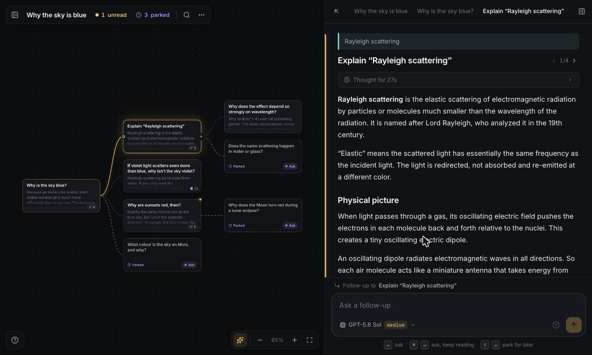

# Tree Learn

A chat for learning that grows as a tree instead of a line.



Every question and its answer is one node. Ask from any node and you get a branch, so the ten counter-questions you
thought of while reading the first paragraph all have somewhere to go. The ones you cannot chase right now can be
**parked**: they sit on the canvas as an open loop until you come back. Select any phrase in an answer and ask about
that phrase, and the passage stays highlighted afterwards, linked to the branch that grew from it.

**[Try it](https://tree-learn.srijanshukla18.workers.dev)** with your own OpenRouter key, or run it locally against
whatever models you already have.

## Two ways to run

| | Local | Hosted |
| --- | --- | --- |
| Models | everything your [pi](https://www.npmjs.com/package/@earendil-works/pi-coding-agent) setup can reach | your own OpenRouter key |
| Storage | one JSON file per topic in `data/` | IndexedDB, in your browser |
| Server | a small local API | none, the page is static |
| Start | `npm run dev` | `npm run deploy` |

Both run the same engine. The difference is only where topics are kept and who answers the questions.

## Running it locally

```bash
npm install
npm run dev
```

The interface is at **http://localhost:5180**.

### Models come from pi

[pi](https://www.npmjs.com/package/@earendil-works/pi-coding-agent) is a coding-agent CLI that keeps your provider
setup in `~/.pi/agent`. Tree Learn loads pi's model runtime as a library, so whatever you have already configured
there simply works, with nothing to re-enter:

- **API keys** for Anthropic, OpenAI, Google, OpenRouter and the rest
- **OAuth subscriptions**, including Claude and ChatGPT/Codex plans, with token refresh handled by pi
- **Local servers** such as llama.cpp, LM Studio, Ollama or MLX, which cost nothing to run
- **Custom endpoints** you have added to pi's `models.json`, including private gateways

Changes you make in pi show up the next time you open the model menu, so enabling a model or logging into a new
provider needs no restart here. Your pi defaults are the defaults here too.

### If you have never used pi

You do not need it. pi also reads the usual provider environment variables, so one key is enough to start:

```bash
OPENROUTER_API_KEY=sk-or-v1-... npm run dev
```

`ANTHROPIC_API_KEY`, `OPENAI_API_KEY`, `GEMINI_API_KEY` and friends work the same way. With no key and no pi config
the model menu is empty and says so, rather than failing at the moment you ask something.

With nothing configured beyond a gateway key, the first question goes to the cheapest metered model available, so a
first run costs a fraction of a cent. Pick whatever you actually want from the model menu, which lists prices.

### Other settings

The API listens on `127.0.0.1:4747` and refuses requests from other machines and other websites, because it can spend
your provider credits. To reach it from your phone on the same network, name the host you will use:

```bash
TREE_LEARN_ALLOWED_HOSTS=my-mac.local npm run dev
```

`PORT` moves the API, `WEB_PORT` moves the interface, `TREE_LEARN_DATA` moves where topics are stored.

## Deploying the hosted version

Live at **https://tree-learn.srijanshukla18.workers.dev**.

```bash
npx wrangler login
npm run deploy
```

That builds a static site and puts it on Cloudflare. There is no server, no database and no account to create, so
there is nothing to operate and nothing of anyone else's to look after.

New visitors start on DeepSeek V4.1 Flash with a low thinking effort, which is quick and costs fractions of a cent,
and with **fast** routing on. That last one appends OpenRouter's `:nitro` modifier to the request, asking for the
fastest provider serving that model rather than the cheapest, which is worth it when you are reading an answer as it
streams. It is a toggle in the model menu rather than a separate entry in the list, and it can be turned off. Any
model in the menu works with it.

Visitors bring their own OpenRouter key, either by approving the app on openrouter.ai (OAuth with PKCE, which mints a
separate key they can cap or revoke) or by pasting one. The key lives in their browser. The build ships a
`Content-Security-Policy` that only allows connections to `https://openrouter.ai`, so the browser itself refuses to
send that key, or anything the learner reads and writes, anywhere else. Worth checking in DevTools rather than
believing this file.

`.env` holds `VITE_REPO_URL`, the link behind the app's "open source" line. If you fork this, point it at your fork,
otherwise you are asking people to trust code that is not the code you deployed.

## How it fits together

```
shared/     the whole app, minus its surroundings
  engine.ts     asking, branching, parking, undo, suggestions, auto-titles
  tree.ts       tree shape, search, Markdown export
  prompts.ts    the tutor prompt and how a root→node path becomes chat turns
  openrouter.ts the OpenRouter adapter and its OAuth
server/     local mode: JSON files + pi, exposed over HTTP with SSE streaming
web/        the interface; backend/local.ts talks to that server, backend/hosted.ts runs the engine in the browser
```

The engine does not know where topics are stored or who answers questions. Local mode hands it files and pi; hosted
mode hands it IndexedDB and OpenRouter. Adding another provider or another store means writing one adapter, not a
second app.

Generation belongs to the engine rather than to a connection. Close the tab mid-answer in local mode and the answer
still finishes and is saved; the tree picks it up when you come back. A process that dies mid-stream leaves no
half-written node either: an unfinished question simply returns to parked.

## Scripts

| Command | What it does |
| --- | --- |
| `npm run dev` | local mode, API and interface together |
| `npm run dev:hosted` | hosted mode against real OpenRouter |
| `npm run typecheck` | type-check everything |
| `npm run build` / `npm start` | build and serve local mode from one process |
| `npx tsx scripts/smoke.ts <api-url> [model]` | end-to-end test of a running local server (it creates and deletes topics, so point it at a scratch `TREE_LEARN_DATA`) |
| `npx tsx scripts/openrouter-check.ts [model]` | check the OpenRouter adapter against the real API |
| `npx tsx scripts/mock-openrouter.ts` | a fake OpenRouter for developing hosted mode offline |
| `npx tsx scripts/make-sample.ts <api-url> [model]` | regenerate the sample tree |

Developing hosted mode without spending anything:

```bash
npx tsx scripts/mock-openrouter.ts
VITE_OPENROUTER_BASE=http://localhost:4750/api/v1 VITE_OPENROUTER_AUTH=http://localhost:4750/auth npm run dev:hosted
```

## Keyboard

`/` ask · `⌘↵` ask and keep reading · `⌥↵` park for later · `⌘K` search everything · `←→` parent and child ·
`↑↓` the node above and below · `U` next unread · `P` next parked · `R` suggest rabbit holes · `B` bookmark ·
`C` fold · `F` fit the tree · `O` topic overview · `N` new topic · `⌫` delete (with undo) · `[` `]` panels ·
`?` the full list

## License

MIT. Fork it, run it, change it, ship it.

## Your topics

They are yours and they are portable: a topic exports as Markdown or JSON, the whole library backs up to one file,
and either imports into either mode. In hosted mode they live only in that browser, so clearing site data clears them.
